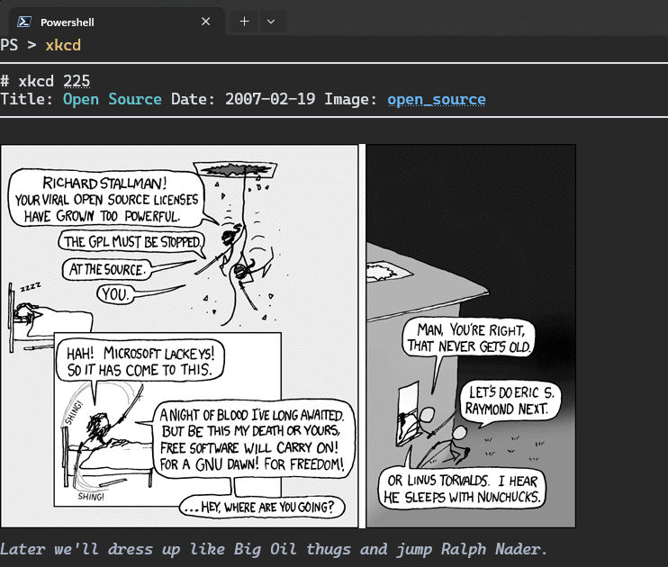
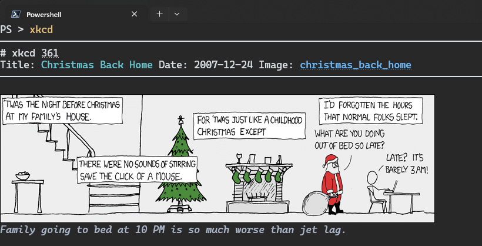
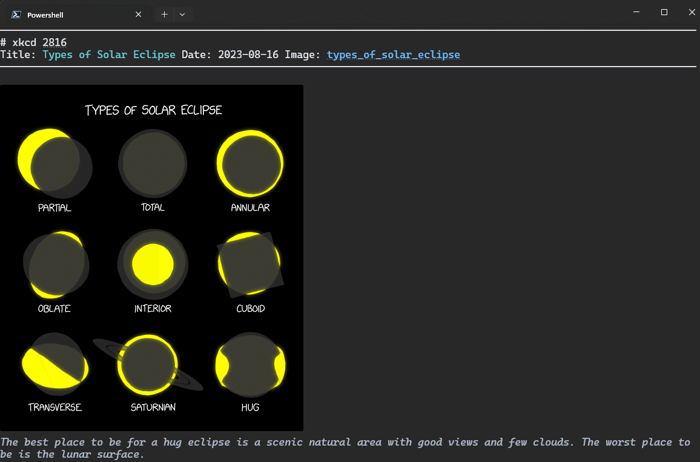

# sixkcd

This is just a fun module to demo sixels in the terminal.  

using [Sixel](https://www.powershellgallery.com/packages/Sixel/) module.  

```ps1
Install-Module sixkcd
# or
Install-PSResource sixkcd
```

## examples

  

  

  
